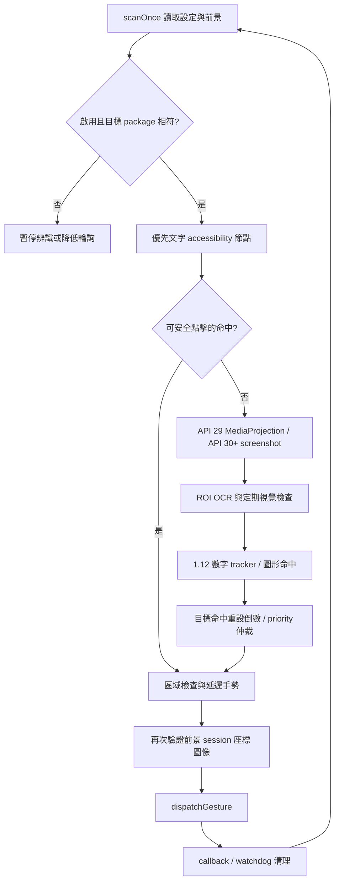

# CSC 1.14 工程交接文件

交接日期：2026-09-04。產品：Android 本機多區域螢幕辨識與自動手勢工具。套件：`com.example.csc`。

本次需求：回復 1.12 的辨識方式，保留最新版介面，交付可接手維護的完整工程資料。交付版號為 **1.14 / versionCode 15 / arm64-v8a**。版本遞增是為了更新安裝；辨識基線為 1.12，並非安裝舊 APK。

本文件描述本次最終工程。舊的 `ENGINEERING_HANDOFF_CSC_RELIABILITY_2026-09-04.md` 是 1.12 時期的分析與 1.13 實作建議，保留供查證，不應當作目前完成狀態。實際測試與裝置結果見 [驗證紀錄](docs/verification/CSC-1.14.md)。

## 1. 交付內容與版本定位

| 項目 | 位置／用途 |
| --- | --- |
| 工程總覽與操作 | `README.md` |
| 維護約束 | `AGENTS.md` |
| 完整工程說明 | 本文件 |
| 驗證與 APK SHA-256 | `docs/verification/CSC-1.14.md` |
| 可安裝 APK | `APK/CSC-1.14-arm64-v8a.apk` |
| 對應版本標籤 | `v1.14`，由 `git rev-parse v1.14^{commit}` 查提交 |
| 完整工程封存 | 由 `git archive v1.14` 產出，包含版本化原始碼、資源、測試、文檔及歷版 APK |
| 本機驗證原始資料 | `build/handoff-1.14/`，不提交裝置設定快照 |

交付前 HEAD 基線：`d2d74ad74a2b168d04f4c8c205a2f585d1079f76`（1.13）。前一筆 `26c6888` 的 Gradle 版號為 1.11，因此不能使用 `HEAD~1` 取得 1.12。1.12 與 1.13 的原始碼變更合併在同一筆歷史提交中。

### 1.1 1.12 基線的取證

- 保存的 `APK/CSC-1.12-arm64-v8a.apk`：versionName 1.12、versionCode 13、arm64-v8a。
- SHA-256：`3d0e250ebf49a996da807bf81254940c79526d15e7a94703539b0a254e93d0b7`。
- 比對 1.13 修改開始前的原始碼讀取紀錄，找回 `NumberMonitorTracker.kt`、`NumberRegionFingerprint.kt` 及兩組原測試；來源工作紀錄 ID：`01a06843-2b37-7ca2-bc43-da92f81168cc`，修改前讀取序號 56。
- 1.12 APK 的 DEX 含 `isNumericElement`、`numberRegionFingerprint`；1.13 改含 `numericFragments`、`numberRegionSignature`。這與修改紀錄一致。
- 原始碼紀錄與 APK 符號能確認回復方向，但沒有獨立的歷史 1.12 Git tag；不宣稱重建出逐位元相同的歷史 APK。本次另建 `v1.14` 解決往後的可追溯性。

### 1.2 回復與保留範圍

| 元件 | 1.14 最終行為 |
| --- | --- |
| 數字 OCR 分詞 | 回復 1.12：只接受純數字／小數符號元素；非數字元素切斷組合 |
| 數字區域比較 | 回復 1.12：32×32 取樣的量化亮度 Long 指紋，以相等判定 |
| 數字追蹤器 | 回復 1.12：正常值記憶、三次且至少 500ms 的高低值確認、缺失期限再確認 |
| OCR 失敗 | 回復 1.12：相同可靠 ROI 只重辨；變更 ROI／無可靠值時進入缺失流程 |
| 主介面、區域編輯器、主題資源 | 維持 1.13；`MainActivity.kt`、`ui/`、`res/` 無本次修改 |
| 動態數字顯示 | 保留 1.13 最近正常顯示值與「確認中／重新確認」狀態 |
| 三日統計 | 維持最新的 prune 與同步讀寫 |
| Session、過期回呼與 gesture watchdog | 維持 1.13 保護 |
| Android 10 擷取 request ID／generation | 維持 1.13 保護 |
| 模板、Circle-X、返回箭頭演算法 | 1.11 至 1.13 間這些檔案本來就沒有變動，本次保持一致 |
| 所有使用者設定、zones JSON、圖片 URI | 不改持久格式，不重設 |

**行為取捨：** 1.12 的 Invalid 會在 ROI 已變更時按缺失處理。因此持續 OCR 錯誤可能在等待與重新辨識後觸發缺失上滑；這是本次明確回復的舊版語意，有回歸測試固定。保留 session 與手勢安全檢查不代表已消除此項辨識誤判風險。

## 2. 環境與依賴

| 項目 | 專案設定 |
| --- | --- |
| 語言／UI | Kotlin；Android programmatic View，沒有 Compose、WebView 或 XML activity layout |
| Gradle Wrapper | 9.5.0，`gradle/wrapper/gradle-wrapper.properties` |
| Android Gradle Plugin | 9.3.0，根目錄 `build.gradle.kts`；使用其內建 Kotlin 支援 |
| compileSdk／targetSdk／minSdk | 36／36／29 |
| Java 編譯相容性 | 17；本次 Gradle 執行 JVM 為既有 Oracle JDK 21.0.11 |
| SDK 本機路徑 | 由未提交的 `local.properties` 指定；本機為 `D:\codee\abc\.android-tools\sdk` |
| Build Tools | 本機 36.0.0 |
| OCR | ML Kit Latin `text-recognition:16.0.1`、Chinese `text-recognition-chinese:16.0.1`，模型隨 APK 打包 |
| 測試 | JUnit 4.13.2，純 JVM 邏輯／合成像素測試 |
| ABI | 交付必須傳入 `-PtargetAbi=arm64-v8a`；不可交付未指定 ABI 的通用包 |
| 簽章 | 本次使用原本 debug 簽章；私鑰不隨工程封存散發 |

新接手電腦需自行設定 SDK 路徑及可執行 AGP／Gradle 的 JDK。Java sourceCompatibility 17 不等於 Gradle 必須以 JDK 17 啟動。應沿用本次已驗證組合或先驗證其他版本，不要為了辨識問題任意升降依賴。

## 3. 原始碼導覽

所有 Kotlin 路徑均位於 `app/src/main/java/com/example/csc/`。

| 路徑 | 職責／接手入口 |
| --- | --- |
| `MainActivity.kt` | 啟用開關、權限流程、設定卡片、三日統計、區域及目標編輯、儲存設定 |
| `automation/AutomationConfig.kt` | 設定模型與 prefs 契約、座標轉換、安全區域、小數文字組合與過濾 |
| `automation/ScreenAutomationService.kt` | scan → capture → OCR／vision → 判定 → 延遲／重驗 → gesture；狀態 overlay |
| `automation/ActionStateMachine.kt` | 非同步辨識與手勢階段仲裁 |
| `automation/AutomationSession.kt` | 前景／設定／擷取世代與 action token 的有效性 |
| `automation/AdaptiveScanController.kt` | 畫面穩定性、確認加速、手勢後掃描節奏 |
| `automation/NumberMonitorTracker.kt` | 與 Android API 無關的 1.12 數字時間序列判定 |
| `automation/NumberRegionFingerprint.kt` | 與 Bitmap 無關的 ROI 亮度指紋，pixel provider 由呼叫端提供 |
| `automation/DailyTriggerStats.kt` | 成功優先上滑統計，按本機日期只保留三日 |
| `automation/AutomationActionReceiver.kt` | 通知中的立即停止入口 |
| `capture/MediaProjectionCaptureService.kt` | API 29 擷取：foreground service、ImageReader、回呼與資源釋放 |
| `capture/MediaProjectionAuthorizationGate.kt` | 授權待啟動狀態，避免 onResume 時重複要求授權 |
| `capture/MediaProjectionRequestState.kt` | 純 JVM request 狀態規則；目前實際 service 使用自己的 PendingFrameRequest，勿把該測試當作完整 service 整合測試 |
| `vision/TemplateMatcher.kt` | 灰階與邊緣特徵、多尺度模板、prepared screen 與 reference 快取 |
| `vision/CircleXDetector.kt` | 圓圈＋X 幾何偵測 |
| `vision/BackArrowDetector.kt` | 白色向左箭頭幾何偵測 |
| `vision/CircleXAutoCalibrator.kt` | runtime-only 的分區校正，不覆寫使用者門檻 |
| `ui/RegionSelectorView.kt` | 0..1 比例座標區域編輯、鎖定與拖曳控制 |

其他必要檔案：`AndroidManifest.xml`、`res/xml/accessibility_service_config.xml`、`assets/default_profile.json`、`assets/profile_images/`、`app/proguard-rules.pro`。模板參考資源必須隨工程保留。

## 4. 核心資料流



### 4.1 執行緒與資源

- 主執行緒：設定狀態、Handler 排程、View／overlay、Android gesture。
- 單一 vision executor：既有圖像辨識工作；ML Kit 使用非同步 Task 回呼。
- API 29 capture thread：ImageReader 擷取。callbackLock 只管理 request 所有權；回呼在鎖外執行。
- Bitmap、裁切圖、prepared screen、HardwareBuffer、Image 均需在成功／失敗／取消／過期路徑釋放；修改時逐一檢查 return 路徑。
- 不得另加平行手勢狀態來源。現有 processing／pending flags 與 ActionStateMachine 必須一起檢視，不能只測純狀態類就假定 Service 完全安全。

### 4.2 文字、圖片與幾何辨識

- 優先文字先搜尋 accessibility 節點，未命中再走 OCR。數字監控開啟時有 number-first 路徑。
- OCR 範圍是文字區域及數字區域的聯集加 padding；若設定很分散，聯集可能接近全畫面，並非永遠只辨識單一小框。
- OCR 裁切座標必須加 offset 回到完整截圖，再轉換成顯示／手勢座標。
- 數字候選需完整位於監控 ROI 並符合色彩條件；色彩至少 8 個樣本且覆蓋率至少 1.5%。候選取最靠近監控中心者，距離相同時取較小面積。
- 純數字相鄰元素可依高度、基線與間隔合併，例如 `0`、`.`、`2` → `0.2`。`S0.2`、`幣0.2`、`0.2元` 不再從混合元素中抽出數字；非數字元素會阻斷合併。
- 模板／幾何命中使用原有閾值、空間一致性及點擊前重新擷取驗證。`resetImageEvidence()` 目前是空方法；不可將舊註解推論為另有多幀命中累積器。
- Circle-X 誤判應從幾何、負空間、外圈 isolation、完整邊界及正負樣本分析；不能只拉高全域門檻。

### 4.3 1.12 數字決策表

| 觀察／狀態 | 決策 |
| --- | --- |
| 數值在停留門檻與上限內（含 epsilon 等號） | STAY，記住正常值與 ROI 指紋，清除風險／缺失 |
| 非正常結果，但 ROI 與最近可靠值的指紋完全相同 | REQUEST_FRESH_OBSERVATION，清除風險／缺失 |
| 變更 ROI 的低值或高值 | 同方向、相近數值至少三次，首末相隔至少 500ms 才要求上滑 |
| 高低方向變更／值跳動太大 | 重設該方向的計數 |
| Missing 或 Invalid，且不符合相同可靠 ROI | 開始／維持缺失計時 |
| 缺失期限到 | 只要求新觀察，不由計時器直接上滑 |
| 期限後新 Missing／Invalid 觀察且達最少觀察數 | SWIPE_ABSENT |
| 正常數字回來 | 清除缺失計時 |
| prioritySwipePending | 一般數字規則回 STAY，不搶優先上滑 |
| tracker generation 改變 | 清空舊證據 |

數值相近容差為 `max(0.02, abs(previous) × 0.08)`。邊界 epsilon 為 `0.000001`。ROI 指紋是 32×32 個內部取樣點，RGB 加權灰階後除 12 量化，再累積 Long 雜湊；不做 1.13 的近似距離比較。雜湊只描述取樣後內容，不代表所有像素相同。

### 4.4 手勢、優先序與統計

- ActionStateMachine 階段：IDLE、RECOGNIZING、CLICK_DELAY、CLICKING、SWIPE_DELAY、SWIPING、COOLDOWN。
- 點擊區域的兩軸交集須達最小安全重疊比例 45%；隨機點擊仍限於安全交集內，最終入口再檢查設定區域。
- 設定的點擊後優先上滑會先占用優先通道；其他區域仍命中時重設等待，消失後重新倒數。
- 上滑約由螢幕 Y 82–86% 至 8–12%，360–440ms；完成後等 900ms 再恢復辨識。
- 成功的 priority swipe callback 才累加三日統計；一般數字 low／high／absence 上滑不累加這項「點擊後」統計。
- 保留 1.13 的 4 秒 gesture watchdog、session/token 判定與 screenshot/projection generation。這些是保護機制，並非本次恢復的辨識算法。

## 5. 設定與資料契約

主設定檔為 app 私有目錄 `shared_prefs/automation.xml`；統計為 `shared_prefs/daily_trigger_stats.xml`。不得以卸載重裝、`pm clear` 或刪 prefs 作為一般更新方法。

| prefs key | 型別／意義 |
| --- | --- |
| `enabled` | Boolean，自動辨識開關 |
| `target_package` | String，前景 package 必須完全相符 |
| `recognition_zones_v1` | String，JSON 陣列，最多 8 區、每區最多 20 目標 |
| `threshold` | Float，模板閾值 0.55..0.99 |
| `circle_x_threshold`／`back_arrow_threshold` | Float，各圖形閾值 0.50..0.99 |
| `scan_interval` | Long，基本掃描設定 500..5000ms；runtime adaptive cadence 另外調整 |
| `cooldown` | Long，1000..15000ms |
| `random_click_max` | Long，100..3000ms |
| `show_click_marker` | Boolean，點擊定位圈 |
| `number_monitor_enabled` | Boolean，數字監控 |
| `number_monitor_left/top/right/bottom` | Float，0..1 比例 ROI |
| `number_monitor_threshold`／`number_monitor_upper_limit` | Float，0..999999 |
| `number_color_filter_enabled` | Boolean，色彩篩選 |
| `number_color_hex`／`number_color_tolerance` | String 色碼／Int 0..255 |
| `number_absence_timeout` | Long，500..30000ms |
| `number_trigger_zone` | String，zone ID；`__none__` 表示沒有指定 |
| `number_trigger_delay` | Long，0..30000ms |
| `bundled_profile_seeded_v1` | Boolean，內建 profile seed 狀態 |
| `mode/target_text/reference_uri/region_*` | 舊格式相容讀取欄位，不任意移除 |
| 統計檔 `counts_v1` | 多行 `YYYY-MM-DD=count`，本機日曆日，只保留今天／昨天／前天 |

zones JSON 示例（說明格式，不是要覆寫的使用者設定）：

```json
[
  {
    "id": "zone-1",
    "name": "區域 1",
    "left": 0.1,
    "top": 0.2,
    "right": 0.9,
    "bottom": 0.8,
    "targets": [
      {"id": "target-1", "mode": "TEXT", "value": "領取", "label": "領取"}
    ]
  }
]
```

mode 為 TEXT／IMAGE／CIRCLE_X／BACK_ARROW。圖片 value 是參考 URI，需保留對應 asset 或裝置授權。既有 bundled return image profile 有特定 migration，不可擴大成按區域索引覆寫使用者資料。新增欄位需相容舊 prefs，區域透過 normalized 限制最小尺寸與邊界。首次 seed 的值與 read fallback 可能不同，請讀 `assets/default_profile.json`，勿把程式 fallback 當成使用者實際值。

## 6. 介面與權限

- 最新主畫面：啟用與服務狀態、簡短狀態文字、三日統計、目標 App、辨識區域、數字監控與進階設定。
- 區域預設鎖定，按調整後才接受四角拖曳；回復辨識不改 UI 互動。
- API 29 需 AccessibilityService 加 MediaProjection。系統擷取同意後需等服務真的 running，不可因 onResume 提早返回而再次跳授權。
- API 30+ 使用 Accessibility screenshot；保留 API guard，不移除 Android 10 路徑。
- Manifest 保留 BIND_ACCESSIBILITY_SERVICE 保護、非 exported capture service／stop receiver、mediaProjection foreground service type。
- INTERNET／ACCESS_NETWORK_STATE 由 manifest merge 移除；OCR 模型在本機執行。debug build 可供 run-as 驗證，並非商店 release 交付。
- 停止入口：主畫面開關、通知「立即停止」。不可移除前景檢查、擷取同意或停止入口。

## 7. 建置與測試操作手冊

Windows PowerShell，從工程根目錄執行。每次 Gradle 前都要建立短 socket 路徑；其他 checkout 應換成該 checkout 的短路徑。

```powershell
New-Item -ItemType Directory -Force -Path 'D:\codee\shop\app\build\uds' | Out-Null
$env:JAVA_TOOL_OPTIONS = '-Djdk.net.unixdomain.tmpdir=D:\codee\shop\app\build\uds'
.\gradlew.bat --no-daemon testDebugUnitTest --tests 'com.example.csc.automation.NumberMonitorTrackerTest' --tests 'com.example.csc.automation.NumberRegionFingerprintTest' --tests 'com.example.csc.automation.RecognitionZoneTest'

New-Item -ItemType Directory -Force -Path 'D:\codee\shop\app\build\uds' | Out-Null
$env:JAVA_TOOL_OPTIONS = '-Djdk.net.unixdomain.tmpdir=D:\codee\shop\app\build\uds'
.\gradlew.bat --no-daemon testDebugUnitTest lintDebug assembleDebug -PtargetAbi=arm64-v8a
```

驗證報告：`app/build/test-results/testDebugUnitTest/TEST-*.xml`、`app/build/reports/tests/testDebugUnitTest/index.html`、`app/build/reports/lint-results-debug.html`。要區分 Kotlin 編譯完成、測試執行完成、APK 建置完成三種結果。

| 測試類別 | 保護的行為 |
| --- | --- |
| NumberMonitorTrackerTest | 相同／變更 ROI、高低值、期限確認、Invalid、優先抑制與世代 |
| NumberRegionFingerprintTest | ROI 外變更不影響指紋、ROI 內小字形變更可被觀察 |
| RecognitionZoneTest／RecognitionRegionTest | 數字組合、候選、色彩、安全點、比例座標、設定相容 |
| ActionStateMachineTest／AutomationSessionTest | 手勢仲裁與 token 失效 |
| AdaptiveScanControllerTest | 掃描節奏與確認 |
| MediaProjectionAuthorizationGateTest／MediaProjectionRequestStateTest | 授權等待及 request 純邏輯 |
| DailyTriggerStatsTest | 成功計次的資料操作與三日清理 |
| vision 下四組測試 | 模板、Circle-X、返回箭頭、校正的純像素／樣本行為 |

單元測試不是實機購物頁驗收；時間序列測試通過也不能證明 ML Kit 真實畫面識別率。

## 8. APK 安裝與驗收手冊

1. 更新 versionName 小版本及 versionCode，傳 arm64-v8a 參數建置。
2. 以 `aapt dump badging` 核對套件、版本、native-code；以 apksigner 比對前版簽章。
3. 在 `APK/` 以新版本檔名保存，不覆蓋歷版。
4. `adb devices -l` 確認授權，後續每個指令都加 `-s <serial>`。
5. 更新前讀取設定、統計、圖片參考與服務狀態。將前景留在 CSC 設定頁，避免驗證時觸發目標 App 手勢。
6. `adb -s <serial> install -r -t APK/CSC-1.14-arm64-v8a.apk`，不可卸載或清資料。
7. 明確啟動 `com.example.csc/com.example.csc.MainActivity`，核對版本、前景、UI 控制項、展開設定等安全操作。
8. 更新後以解析後的 prefs key/value 比較，不只比較 XML 順序。確認 zones／門檻／色碼／時間／URI 保留。
9. 檢查 Accessibility enabled 與 bound、API 29 MediaProjection 是否仍有效；必要時由系統權限流程重新授權。設定 enabled 清單需保留其他服務。
10. 檢查本次啟動後 logcat 的 FATAL EXCEPTION／AndroidRuntime／ANR；不要把先前裝置歷史 crash 當成本版新 crash。
11. 保存結果、建立對應 Git commit 與 `v1.14`，核對 tag 中 build.gradle、APK SHA 及原始碼。

常用唯讀檢查：

```powershell
$adb = 'D:\codee\abc\.android-tools\sdk\platform-tools\adb.exe'
$serial = '<已確認授權的裝置序號>'
& $adb -s $serial shell dumpsys package com.example.csc
& $adb -s $serial shell dumpsys accessibility
& $adb -s $serial shell dumpsys media_projection
& $adb -s $serial shell dumpsys activity activities
& $adb -s $serial shell run-as com.example.csc cat shared_prefs/automation.xml
& $adb -s $serial logcat -d -b crash
```

設定快照含使用者資料，僅保存在本機被忽略的 build/captures 路徑，不放入公開交接封存。

## 9. 故障排查與已知限制

| 現象 | 檢查順序 |
| --- | --- |
| Gradle loopback／PipeImpl／UnixDomainSockets／Invalid argument | 先測 repository-local `jdk.net.unixdomain.tmpdir`，看第一個有意義的 Caused by；不修改全機 TEMP/TMP、hosts、JDK 或 Android 原始碼碰運氣 |
| 有介面但無辨識 | enabled、正確 target package、Accessibility bound、API 29 capture running、是否正在手勢或等待 |
| 數字一直重新確認 | 比對 ROI 原圖與可靠指紋、分詞結果、顏色覆蓋及目前門檻；相同可靠 ROI 的異常結果按舊版會重辨 |
| 混字數字漏判 | 1.12 刻意拒絕混合元素，先確認 ROI／字體／顏色；不要直接恢復 1.13 numericFragments |
| 無數字後上滑 | 確認 Missing／Invalid、ROI 是否變動、缺失期限與期限後 fresh observation |
| 圖形誤判 | 保存正負樣本，先檢查區域、形狀及 isolation，避免只有門檻調整 |
| 點擊被拒 | 前景／session／安全交集／區域／點擊前重驗是否一致 |
| 長時間沒有下一幀 | 檢查 processing、pending gesture、capture request、watchdog；純 request tracker 測試不涵蓋全部實際 callback |
| 更新後服務未運作 | Android 可能清掉綁定或 projection，按系統流程恢復並重新 dumpsys |

其餘限制：FLAG_SECURE 無法截圖；OCR 會受動畫、字體、縮放、方向及壓縮影響；ROI 指紋有取樣盲點和雜湊碰撞可能。保留的 1.13 session/gesture callback 還需要真正的跨 App／取消／逾時整合壓力測試，不能據此宣稱無限期無人值守穩定。

本次未取得一組相同畫面的 1.12／1.14 長時間 A/B 準確率數據。功能回復有原始碼與測試證據；「實際較穩」需在使用者目標場景驗收。

## 10. 後續驗收清單與回退

真實目標 App 自動手勢測試需取得使用者對具體測試情境的授權。建議在可控制的非交易頁面完成：

- 正常值連續五分鐘；不因一幀 OCR 漏字上滑。
- 真正低值／高值，確認至少三次且跨 500ms。
- 畫面不變但 OCR 錯誤，維持重新確認；畫面變更且持續錯誤，確認 1.12 缺失語意。
- 數字重新出現時取消缺失計時；期限點未取得新結果不得由 timer 直接上滑。
- 點擊後優先等待、其他區域命中重設、解除後完整重新倒數；一般數字規則不搶手勢。
- 切離 App、設定修改、擷取服務重啟、gesture 取消／回呼逾時，過期動作不得在新頁執行。
- 完成一個優先上滑才累加一次統計，失敗／取消不計。

要取得本次完全對應的工程，在新的空資料夾 clone／checkout `v1.14`，或使用由該 tag 產生的 zip。勿在有使用者修改的 checkout 執行 reset --hard。

若需回到其他辨識基線，先建立新分支並比對特定元件，保留最新 UI 與資料格式，再遞增版本重新交付。舊 APK 有較低 versionCode，不能假設一般 replacement install 可直接降級；禁止用卸載當捷徑而遺失資料。歷版 APK、commit、tag 不得覆蓋或刪除。

## 11. 接手第一步

先讀本文件與驗證紀錄，再確認 `git status`、`git show v1.14:app/build.gradle.kts`、APK 雜湊與授權手機狀態。針對新問題先收集畫面／辨識輸出／時間序列，從受影響的單一測試類別開始。若將來重新設計數字判定，需保留 1.12 回歸案例，讓每項語意變更都有明確理由。
